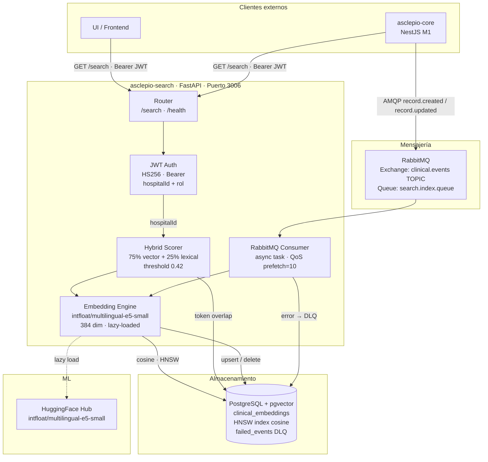
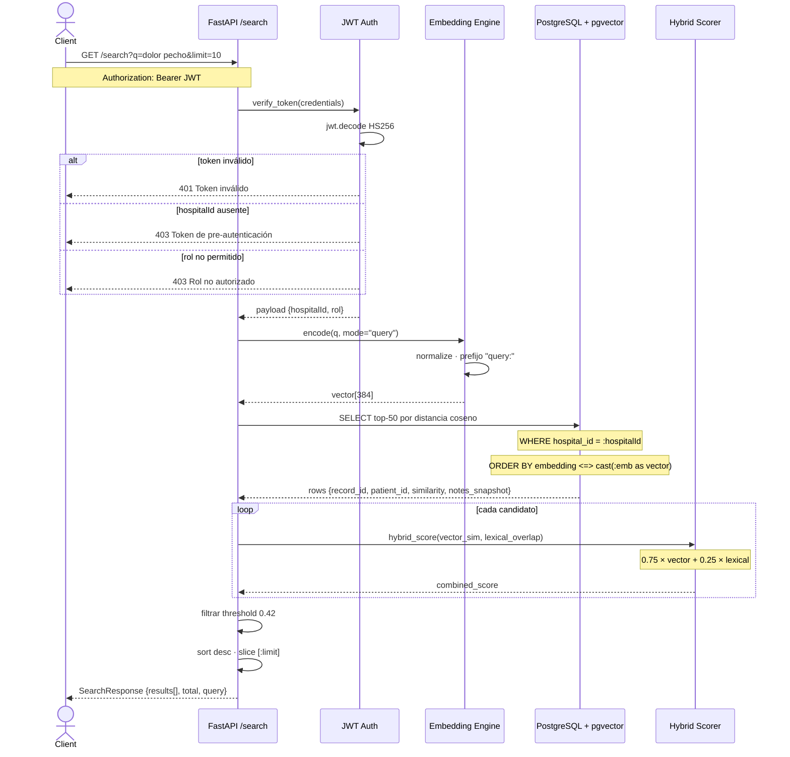
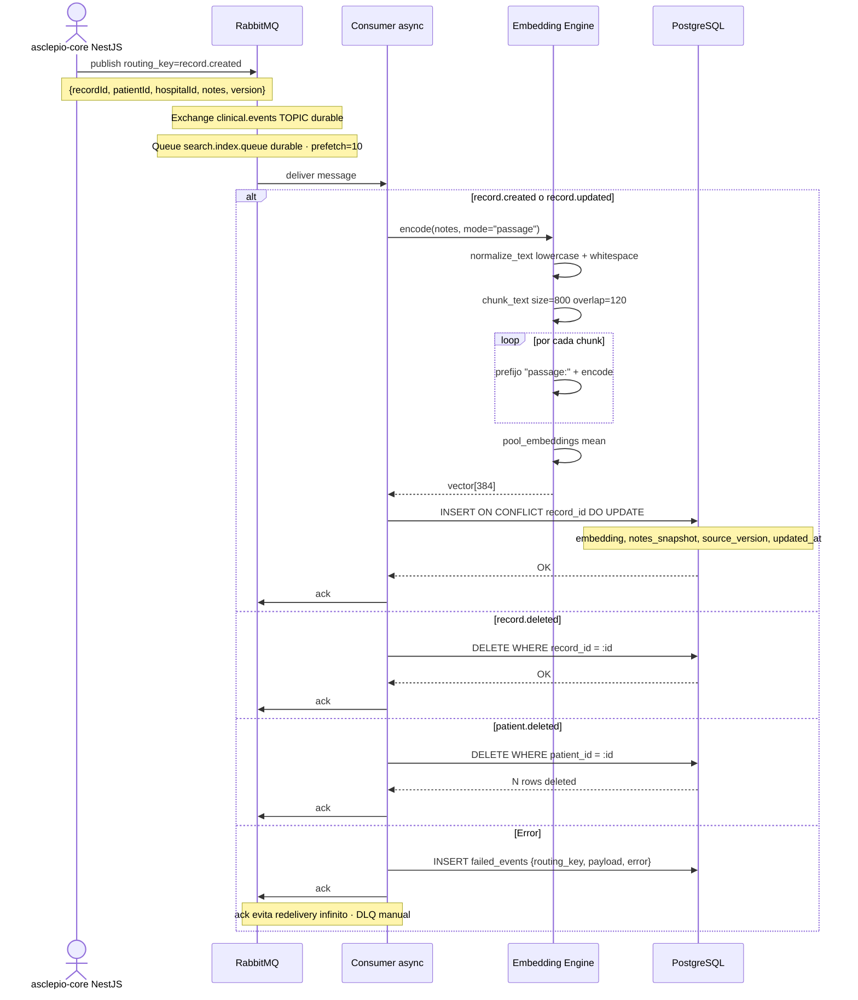
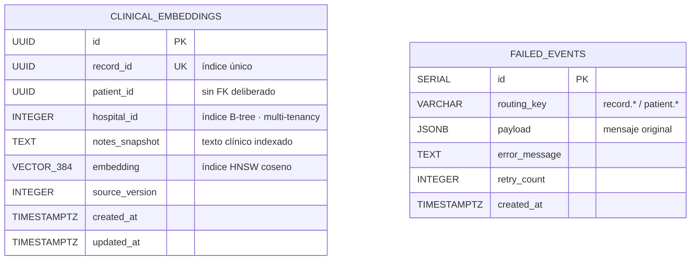
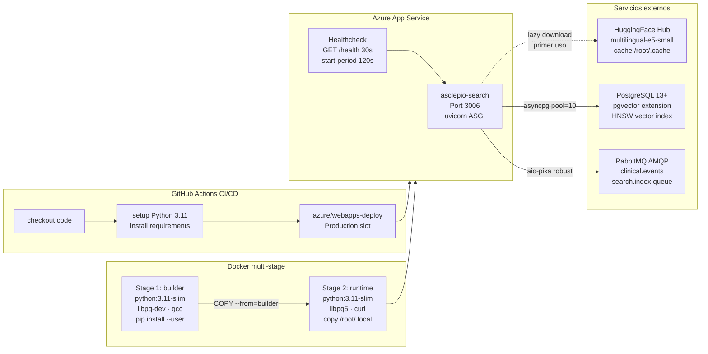

# asclepio-search — Diagramas de Arquitectura

## 1. Arquitectura de Componentes

---

## 2. Flujo de Búsqueda (Sequence)

---

## 3. Flujo de Indexación (Sequence)

---

## 4. Modelo de Datos (ER)

---

## 5. Arquitectura de Despliegue

<!-- Daniel Useche -->
